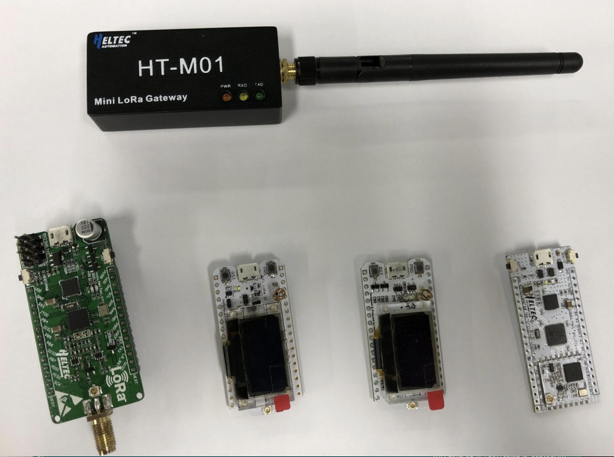
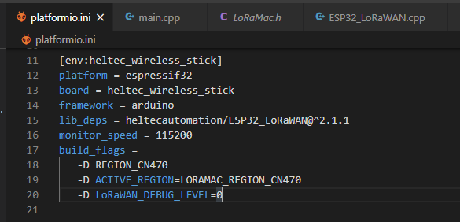

## Contents

- [The Overview](#the-overview)
- [Installing](#installing)
- [Features](#features)
- [Test information](#test-information)
- [How to use this library](#how-to-use-this-library)
- [Contact us](#contact-us)

# The Overview

- **This library must work with newest [Heltec_ESP32 development framework](https://github.com/Heltec-Aaron-Lee/WiFi_Kit_series)**
  - *For now, new features still not included in the release version, must install this framework via Git.*
- This library is make LoRaWAN 1.0.2 protocol running with ESP32. Only support the ESP32 + LoRa series products made by [HelTec Automation(TM)](heltec.org), and a [LoRa gateway](https://heltec.org/proudct_center/lora/lora-gateway/) is must needed;
- LoRaWAN relevant parameters are defined in the .ino file;
- This library is transplanted from https://github.com/Lora-net/LoRaMac-node;
- Use RTC and deep sleep mode supported, only a few milliseconds wake up in a cycle;
- **[Heltec LoRa Node Family]([Heltec Automation(TM) products index page](https://docs.heltec.cn/#/en/products/lora/lora_node/heltec_lora_node_list)).**


# Installing

To install this library:

- install it using the Arduino Library manager ("Sketch" -> "Include Library" -> "Manage Libraries..."), or
- download a zip file from GitHub using the "Download ZIP" button and install it using the IDE ("Sketch" -> "Include Library" -> "Add .ZIP Library..."
- clone this git repository into your sketchbook/libraries folder.

For more info, see https://www.arduino.cc/en/Guide/Libraries

# Features

The `ESP32_LoRaWAN` library provides a fairly complete LoRaWAN Class A and Class C implementation. The latest update (February 10th, 2020) has full region support (KR920, AS923, US915, etc.).

The following functions are included:
 - LoRaWAN protocol V1.0.2 Class A and Class C;
 - Use ESP32's internal RTC (15KHz);
 - All [ESP32 + LoRa](https://heltec.org/proudct_center/lora/lora-node/) boards made by [Heltec Automation(TM)](heltec.org) can use this library;
 - Support deep sleep and stop mode;
 - Receive and print downlink payload;
 - Print and OLED show downlink data length and RSSI;
 - An unique license related to Chip ID is needed, you can check your license here: http://www.heltec.cn/search/

# Test information


 - Gateway: [HT-M01 Mini LoRa Gateway](http://www.heltec.cn/project/ht-m01-lora-gateway/?lang=en) + Raspberry Pi Zero W
 - Node: [WIFI LoRa 32 V2](https://heltec.org/project/wifi-lora-32/), [Wireless Stick](https://heltec.org/project/wireless-stick/), [Wireless Stick Lite](https://heltec.org/project/wireless-stick-lite/)
 - Lora Server:
    - [Heltec Cloud Server](http://cloud.heltec.org/);
    - [TTN](https://www.thethingsnetwork.org/).
 - Arduino 1.8.10

| working band | status |
| :----------------: | :------------:|
| EU433 | not test |
| CN470 | work well |
| EU863 | work well |
| US915 | work well |
| AU916 | work well |
| CN779 | not test |
| AS923 | not test |
| KR920 | not test |
| IN865 | not test |
| US915_HYBRID | not test |

**What certainly works:**

 - Sending payload to a LoRa gateway via LoRaWAN protocol;
 - Encryption and message integrity checking;
 - Over-the-air activation (OTAA / joining);
 - Deep sleep and wake up；
 - Class A operation;
 - Class C operation;
 - ABP mode.

**What has not been tested:**

 - Receiving downlink packets in the RX2 window.

# How to use this library
The only different with a common Arduino library is need a unique license. It's relate to ESP32 Chip ID.

### How to get your board's Chip ID?
 - Use this simple example to read your Chip ID: https://github.com/Heltec-Aaron-Lee/WiFi_Kit_series/tree/master/esp32/libraries/ESP32/examples/ChipID/GetChipID

### How to get the unique license?
 - http://www.heltec.cn/search/ Open this page and input your ChipID

Only the boards made after August 2018 can be checked from this page, if you have a former version, you can mail to support@heltec.cn and improve you already have a Heltec Automation made board.

### Choose the right working band you need

Choose working band you need In the Arduino tools menu: 


For more details about how to use this library, please refer to this document:

[ESP32 LoRaWAN library usage](https://heltec-automation-docs.readthedocs.io/en/latest/esp32/lorawan/index.html).

&nbsp;

### How to Use This Library in Platform.io?

The options in the Tools menu is relate to the [Heltec ESP32 development framework](https://github.com/Heltec-Aaron-Lee/WiFi_Kit_series), but in the Platform.io, it's use original [Espressif ESP32 framework](https://github.com/espressif/arduino-esp32). So we need additional definition the `build_flags` in `platformio.ini` file.

```shell
build_flags = 
   -D REGION_CN470
   -D ACTIVE_REGION=LORAMAC_REGION_CN470
   -D LoRaWAN_DEBUG_LEVEL=0
```




# Contact us
- **Website：[https://heltec.org](https://heltec.org/)**
- **Document Page: [https://docs.heltec.cn](https://docs.heltec.cn)**
- **Forum: [http://community.heltec.cn/](http://community.heltec.cn/)**
- **Twitter: [https://twitter.com/HeltecOrg](https://twitter.com/HeltecOrg)**
- **Face Book: [https://www.facebook.com/heltec.automation.5](https://www.facebook.com/heltec.automation.5)**

# Issue/Bug report template
Before reporting an issue, make sure you've searched for similar one that was already created. Also make sure to go through all the issues labeled as [for reference](https://github.com/HelTecAutomation/ESP32_LoRaWAN/issues).

Also you can talk in our forum: [http://community.heltec.cn/](http://community.heltec.cn/)
